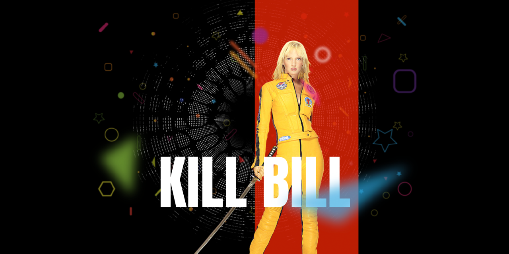

<p id="header"><p>

<table><tr>
<td> <a href="https://github.com/emjose/form-validation/#header"></a> </td>
<td> <a href="https://github.com/emjose/one-hundred/#header"></a> </td>
<td> <a href="https://github.com/emjose/video-scroll-one/#header"></a> </td>
</tr></table>

<br>

<p id="project-title"><p>

<a href=#table-of-contents></a>

<br>

<a href="https://emjose.github.io/parallax-background/"></a>

#

<p id="table-of-contents"><p>

<a href=#table-of-contents></a>

-   [100 Days of Code](#100days)
-   [Installation](#installation)
-   [Live Site](#live-site)
-   [Resources](#resources)
-   [Copyright](#copyright)
-   [Let's Connect!](#lets-connect)

#

<p id="100days"><p>

<a href=#100days></a>

### Day 15: February 21, 2021

-   I made a parallax mouse mouse effect for Day 15, and it uses the <a href="http://matthew.wagerfield.com/parallax/">Parallax.js</a> engine.

-   The parallax effect features the character Beatrix Kiddo/The Bride from the film <a href="https://www.miramax.com/movie/kill-bill-volume-i/">Kill Bill</a>. Beatrix is portrayed by the actress <a href="https://www.imdb.com/name/nm0000235/">Uma Thurman</a>.

#

<p id="installation"><p>

<a href=#installation></a>

#### Git clone and cd into the repo folder:

```
git clone git@github.com:emjose/parallax-background.git && cd parallax-background
```

#### Run the command:

```
open index.html
```

#

<p id="live-site"><p>

<a href="https://emjose.github.io/parallax-background/"></a>

<a href="https://emjose.github.io/parallax-background/"></a>

#

<p id="resources"><p>

<a href=#resources></a>

-   #### [Background Parallax Effect Tutorial](https://youtu.be/_qQf1F1daSA) by [Animation Coding](https://www.youtube.com/channel/UCnzIhXjOKIOgB3nIdOKJshQ)

-   #### [Parallax.js](http://matthew.wagerfield.com/parallax/) by [Matthew Wagerfield](https://github.com/wagerfield)

-   #### [Parallax.js on Github](https://github.com/wagerfield/parallax)

-   #### [Google Fonts](https://fonts.google.com/)

-   #### [My blog on how I created my Github READMEs](https://emmanueljose.medium.com/readme-a-makeover-story-b9c7be37a6de?sk=7ae6623d365409d875753e4604e42ffd)

#

<p id="copyright"><p>

<a href=#copyright></a>

-   This project is for made for educational purposes only.
-   All Kill Bill images and characters are copyright of <a href="https://www.miramax.com/">MIRAMAX</a>. © MIRAMAX. All Rights Reserved.

#

<p id="lets-connect"><p>

<a href=#lets-connect></a>

<p><a href="https://twitter.com/Emmanuel_Labor"> <a href="https://www.linkedin.com/in/emmanuelpjose/"> <a href="https://emmanueljose.medium.com/"> <a href="https://www.instagram.com/emmanuel_jose/"> <a href="mailto:emjose@gmail.com"> <a href="https://www.emmanuel-jose.com/"> <a href="https://github.com/emjose"></p>

#

<a href=#header></a>

<!-- commit test -->
